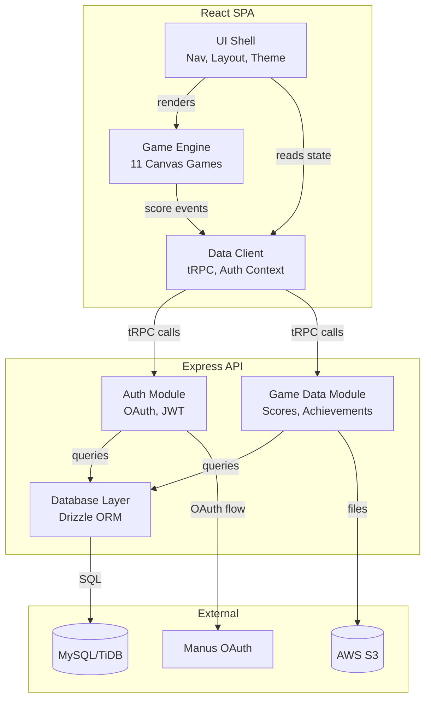

# C4 Component Index — Pixel Playground

## System Components

| Component | Container | Description | Documentation |
|-----------|-----------|-------------|---------------|
| Game Engine | React SPA | 11 HTML5 Canvas game implementations with procedural sound | [c4-component-game-engine.md](./c4-component-game-engine.md) |
| UI Shell | React SPA | Navigation, layouts, theming, and shared UI components | [c4-component-ui-shell.md](./c4-component-ui-shell.md) |
| Data Client | React SPA | tRPC client, React Query, auth context, and state management | [c4-component-data-client.md](./c4-component-data-client.md) |
| Auth Module | Express API | OAuth flow, JWT sessions, and user management | [c4-component-auth.md](./c4-component-auth.md) |
| Game Data Module | Express API | Score submission, leaderboards, achievements, and favorites | [c4-component-game-data.md](./c4-component-game-data.md) |
| Database Layer | Express API | Drizzle ORM schema, query helpers, and migrations | [c4-component-database.md](./c4-component-database.md) |

## Component Relationships

---

## Component Details

### Game Engine (React SPA)

**Purpose:** Implements all 11 arcade games as React components with HTML5 Canvas rendering and Web Audio API sound generation.

**Sub-components:**

| Game | File | Category | Controls |
|------|------|----------|----------|
| Snake | `SnakeGame.tsx` | Classic | Arrow keys / Swipe |
| Flappy Bird | `FlappyBirdGame.tsx` | Action | Space / Tap |
| Dino Jump | `DinoGame.tsx` | Action | Space / Tap |
| Tetris | `TetrisGame.tsx` | Puzzle | Arrow keys / Swipe |
| Pong | `PongGame.tsx` | Classic | Arrow keys / Drag |
| Space Invaders | `SpaceInvadersGame.tsx` | Action | Arrow+Space / Tap |
| Minesweeper | `MinesweeperGame.tsx` | Puzzle | Click / Tap |
| Breakout | `BreakoutGame.tsx` | Classic | Arrow keys / Drag |
| 2048 | `Game2048.tsx` | Puzzle | Arrow keys / Swipe |
| Memory Match | `MemoryMatchGame.tsx` | Brain | Click / Tap |
| Whack-a-Mole | `WhackAMoleGame.tsx` | Reflex | Click / Tap |

**Shared infrastructure:**
- `GameLayout.tsx` — Wrapper providing consistent nav, canvas sizing, and back navigation
- `GameTutorial.tsx` — First-play tutorial overlay with controls and tips
- `ShareScore.tsx` — Social sharing component for game-over screens
- `tutorialData.ts` — Tutorial content definitions for all 11 games
- `useSoundEngine` hook — Procedural 8-bit sound generation via Web Audio API

### UI Shell (React SPA)

**Purpose:** Provides the application shell — navigation, routing, theming, and reusable UI components.

**Key files:**
- `App.tsx` — Route definitions and ThemeProvider wrapper
- `main.tsx` — tRPC/QueryClient providers and auth redirect logic
- `Home.tsx` — Game catalog with search, category filters, favorites tab, and badges
- `Leaderboard.tsx` — Per-game score rankings
- `Achievements.tsx` — Achievement gallery with unlock progress
- `Profile.tsx` — User stats, game history, and achievement showcase
- `Settings.tsx` — Theme, sound, difficulty, and tutorial reset controls
- `index.css` — Design tokens (colors, fonts, spacing) in CSS custom properties

**UI library:** shadcn/ui components (`Button`, `Card`, `Dialog`, `Select`, `Slider`, `Tabs`, `Toast`)

### Data Client (React SPA)

**Purpose:** Manages all client-server communication and client-side state.

**Key files:**
- `lib/trpc.ts` — tRPC React Query client binding
- `hooks/useAuth.ts` — Authentication state hook (user, loading, logout)
- `const.ts` — Login URL builder with state encoding
- `contexts/ThemeContext.tsx` — Theme state (dark/light/system)

**Patterns:**
- All API calls via `trpc.*.useQuery()` / `trpc.*.useMutation()`
- Optimistic updates for favorites toggle
- Cache invalidation on score submission and achievement unlock

### Auth Module (Express API)

**Purpose:** Handles the complete authentication lifecycle — OAuth callback, JWT session management, and user creation/lookup.

**Key files:**
- `server/_core/oauth.ts` — OAuth callback handler, state parsing, token exchange
- `server/_core/context.ts` — Request context builder (extracts user from JWT cookie)
- `server/_core/cookies.ts` — Session cookie configuration
- `server/_core/trpc.ts` — `publicProcedure` and `protectedProcedure` definitions

**Flow:** OAuth redirect → callback → JWT cookie → context injection → `ctx.user` in procedures

### Game Data Module (Express API)

**Purpose:** Business logic for scores, achievements, and favorites — exposed as tRPC procedures.

**Key files:**
- `server/routers.ts` — tRPC router with leaderboard, achievements, and favorites procedures
- `shared/achievements.ts` — Achievement definition catalog and check logic

**Procedures:** 14 tRPC procedures (see Container documentation for full API list)

### Database Layer (Express API)

**Purpose:** Schema definitions, query helpers, and migration management.

**Key files:**
- `drizzle/schema.ts` — Table definitions (users, scores, achievements, favorites)
- `drizzle/relations.ts` — Table relationship definitions
- `server/db.ts` — Query helper functions (submitScore, getTopScores, getUserFavorites, etc.)
- `server/storage.ts` — S3 storage helpers (storagePut, storageGet)

**ORM:** Drizzle ORM with mysql2 driver, migrations via `drizzle-kit`
