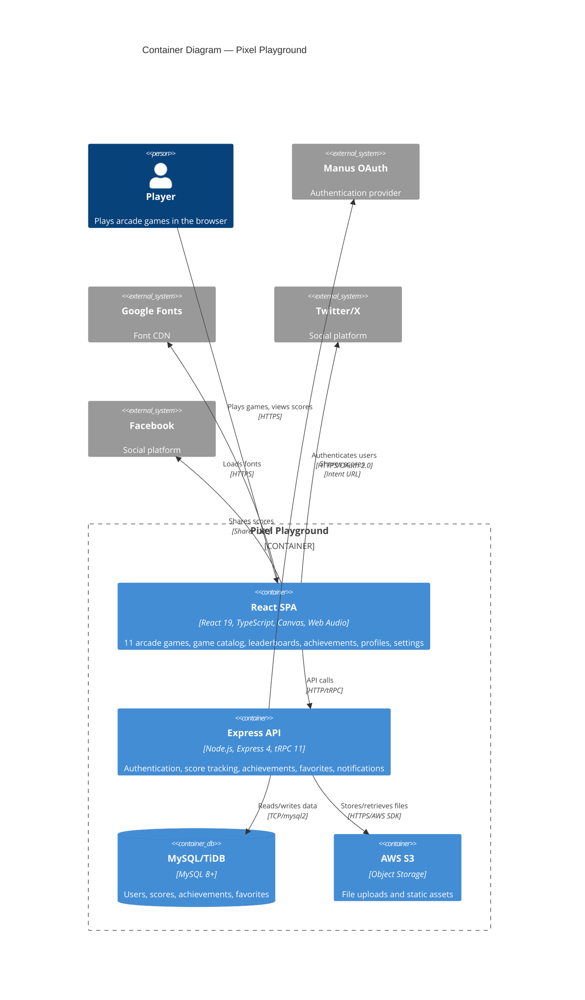

# C4 Container Diagram — Pixel Playground

## Containers

### 1. React SPA (Frontend)

| Property | Value |
|----------|-------|
| **Name** | React Single-Page Application |
| **Type** | Web Application (Client-Side) |
| **Technology** | React 19, TypeScript, Tailwind CSS 4, Vite, HTML5 Canvas, Web Audio API |
| **Deployment** | Static assets served by Express in production, Vite dev server in development |

**Purpose:** Delivers the entire user interface — game catalog, 11 playable games (rendered on HTML5 Canvas), leaderboards, achievements, user profiles, settings, and social sharing. All game logic runs client-side in the browser. Communicates with the backend exclusively through tRPC over HTTP.

**Components:**
- Game Engine Layer (11 canvas-based games with procedural sound)
- UI Layer (pages, components, layouts using shadcn/ui)
- Data Layer (tRPC client, React Query cache, auth context)
- Tutorial System (first-play overlays with localStorage persistence)
- Share System (social sharing via platform intent URLs)

**Interfaces:**
- Consumes: `/api/trpc/*` (tRPC batched HTTP requests to Express API)
- Consumes: Google Fonts CDN (Silkscreen, Outfit)
- Produces: Twitter/X intent URLs, Facebook sharer URLs (client-side navigation)

### 2. Express API (Backend)

| Property | Value |
|----------|-------|
| **Name** | Express + tRPC API Server |
| **Type** | API Server |
| **Technology** | Node.js, Express 4, tRPC 11, Drizzle ORM, SuperJSON |
| **Deployment** | Node.js process (or Vercel Serverless Function in production) |

**Purpose:** Handles all server-side logic — user authentication (OAuth callback, JWT sessions), score submission and leaderboard queries, achievement tracking, favorites management, and owner notifications. Serves the built React SPA in production.

**Components:**
- Auth Module (OAuth flow, JWT session cookies, protected procedures)
- Leaderboard Module (score submission, ranking queries, play counts)
- Achievements Module (unlock tracking, user achievement queries)
- Favorites Module (add/remove/list user favorites)
- System Module (owner notifications, health checks)

**Interfaces:**

| Endpoint Pattern | Method | Auth | Description |
|-----------------|--------|------|-------------|
| `/api/trpc/auth.me` | GET | Public | Get current user session |
| `/api/trpc/auth.logout` | POST | Public | Clear session cookie |
| `/api/trpc/leaderboard.getTopScores` | GET | Public | Top N scores for a game |
| `/api/trpc/leaderboard.submitScore` | POST | Protected | Submit a game score |
| `/api/trpc/leaderboard.getUserBestScore` | GET | Protected | User's best score for a game |
| `/api/trpc/leaderboard.getUserAllBestScores` | GET | Protected | User's best scores across all games |
| `/api/trpc/leaderboard.getUserRecentScores` | GET | Protected | User's recent score history |
| `/api/trpc/leaderboard.getUserTotalGamesPlayed` | GET | Protected | Total games played count |
| `/api/trpc/leaderboard.getUserGameStats` | GET | Protected | Per-game play statistics |
| `/api/trpc/leaderboard.getGamePlayCounts` | GET | Public | Play counts for badge calculation |
| `/api/trpc/achievements.getUserAchievements` | GET | Protected | User's unlocked achievements |
| `/api/trpc/favorites.getUserFavorites` | GET | Protected | User's favorited games |
| `/api/trpc/favorites.toggleFavorite` | POST | Protected | Add or remove a favorite |
| `/api/oauth/callback` | GET | Public | OAuth callback handler |

### 3. MySQL/TiDB Database

| Property | Value |
|----------|-------|
| **Name** | MySQL/TiDB Database |
| **Type** | Relational Database |
| **Technology** | MySQL 8+ / TiDB (cloud-hosted) |
| **Deployment** | Managed cloud database service |

**Purpose:** Persists all application data — user accounts, game scores, achievement unlocks, and game favorites.

**Tables:**

| Table | Description | Key Columns |
|-------|-------------|-------------|
| `users` | User accounts from OAuth | id, openId, name, email, role, createdAt |
| `scores` | Game score submissions | id, userId, game, score, wave, lines, createdAt |
| `achievements` | Unlocked achievement records | id, userId, achievementId, unlockedAt |
| `favorites` | User game favorites | id, userId, gameId, createdAt |

### 4. AWS S3 Storage

| Property | Value |
|----------|-------|
| **Name** | AWS S3 Bucket |
| **Type** | Object Storage |
| **Technology** | AWS S3 via @aws-sdk/client-s3 |
| **Deployment** | AWS managed service |

**Purpose:** Stores uploaded files and static assets. Accessed via `storagePut()` and `storageGet()` helpers on the server side.

## Dependencies

| From | To | Protocol | Description |
|------|-----|----------|-------------|
| React SPA | Express API | HTTP (tRPC batched) | All data operations |
| Express API | MySQL/TiDB | TCP (mysql2 driver) | Data persistence |
| Express API | AWS S3 | HTTPS (AWS SDK) | File storage |
| Express API | Manus OAuth | HTTPS | User authentication |
| React SPA | Google Fonts | HTTPS (CDN) | Font loading |
| React SPA | Twitter/X | HTTPS (intent URL) | Social sharing |
| React SPA | Facebook | HTTPS (sharer URL) | Social sharing |

## Container Diagram

## Related Documentation

| Document | Path |
|----------|------|
| System Context | [c4-context.md](./c4-context.md) |
| Component Index | [c4-component.md](./c4-component.md) |
| API Specification | [apis/express-api.yaml](./apis/express-api.yaml) |
