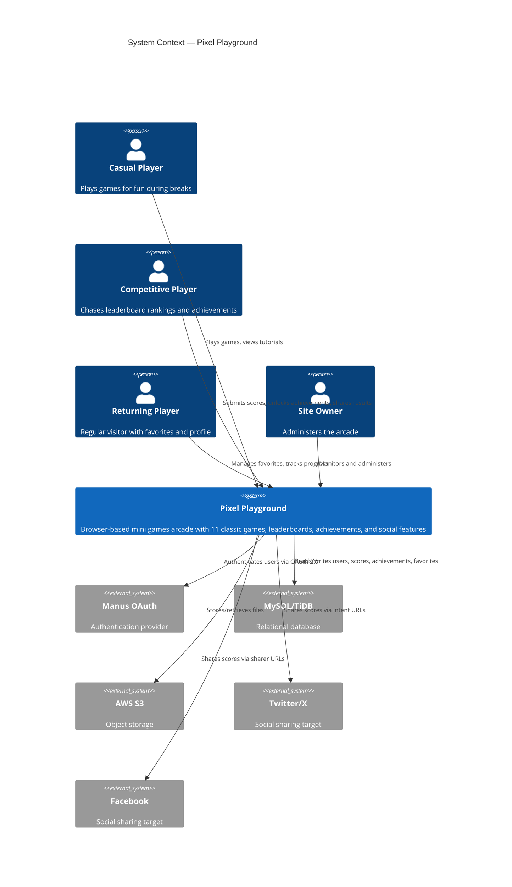

# C4 Context — Pixel Playground

## System Overview

**Short Description:** A browser-based mini games arcade featuring 11 classic games with leaderboards, achievements, social sharing, and user profiles.

**Long Description:** Pixel Playground is a fullstack web application that delivers a curated collection of 11 classic arcade games (Snake, Flappy Bird, Dino Jump, Tetris, Pong, Space Invaders, Minesweeper, Breakout, 2048, Memory Match, Whack-a-Mole) through a polished, neo-retro interface. The system handles user authentication via OAuth, persists game scores and achievements in a relational database, stores user preferences locally, and provides social sharing capabilities. All games run entirely in the browser using HTML5 Canvas with procedural 8-bit sound generation via the Web Audio API.

## Personas

| Persona | Type | Description | Goals | Key Features Used |
|---------|------|-------------|-------|-------------------|
| Casual Player | Human User | A person looking for quick entertainment during breaks or downtime | Play games without friction, track personal bests | Game playing, score display, sound controls |
| Competitive Player | Human User | A player motivated by rankings and achievement hunting | Climb leaderboards, unlock all achievements, share high scores | Leaderboards, achievements, social sharing, profile stats |
| Returning Player | Human User | An authenticated user who visits regularly | Quick access to favorite games, track progress over time | Favorites, profile, settings persistence |
| Site Owner | Human User | The administrator who manages the arcade | Monitor usage, manage users, receive notifications | Admin role, owner notifications |
| Manus OAuth | External System | Authentication provider that handles user identity | Provide secure user authentication | OAuth callback, session management |

## System Features

| Feature | Description | Personas |
|---------|-------------|----------|
| Game Catalog | Browse, search, and filter 11 arcade games by category | All players |
| Game Playing | Play games with keyboard and touch controls in the browser | All players |
| Score Tracking | Submit and persist game scores to the leaderboard | Competitive Player, Returning Player |
| Achievements | Unlock badges for gameplay milestones across all games | Competitive Player |
| Favorites | Star games for quick access via a dedicated filter tab | Returning Player |
| Social Sharing | Share scores to Twitter/X, Facebook, or clipboard | Competitive Player |
| Game Tutorials | First-play overlay showing controls and tips for each game | Casual Player |
| User Profile | View play history, stats, and achievement progress | Returning Player, Competitive Player |
| Settings | Configure difficulty, sound, theme, and reset tutorials | All players |
| Leaderboard | View top scores per game with player rankings | Competitive Player |

## User Journeys

### Play a Game — Casual Player

1. Player visits the homepage
2. Player browses the game grid or uses search/category filters
3. Player clicks "Play" on a game card
4. Tutorial overlay appears (first visit only) showing controls
5. Player dismisses tutorial and begins playing
6. Game-over screen shows score and options (Retry, Share, Home)
7. If logged in, score is automatically submitted to leaderboard

### Compete for High Score — Competitive Player

1. Player logs in via Manus OAuth
2. Player navigates to a game and plays
3. On game over, score is submitted and checked against personal best
4. If new high score, achievement checks run (may unlock badges)
5. Player shares score to social media via Share button
6. Player visits Leaderboard page to see ranking
7. Player visits Profile to review overall stats and achievements

### Manage Favorites — Returning Player

1. Player logs in via Manus OAuth
2. Player browses game catalog on homepage
3. Player taps the star icon on favorite games
4. Player uses the "FAVS" filter tab to see only favorited games
5. Player accesses favorites quickly on return visits

## External Systems and Dependencies

| System | Type | Description | Integration | Purpose |
|--------|------|-------------|-------------|---------|
| Manus OAuth | Authentication Service | Handles user identity and session management | OAuth 2.0 callback flow | User authentication and session cookies |
| MySQL/TiDB | Relational Database | Stores users, scores, achievements, and favorites | Drizzle ORM over mysql2 driver | Data persistence |
| AWS S3 | Object Storage | Stores uploaded files and assets | AWS SDK v3 | File storage (profile images, exports) |
| Twitter/X | Social Platform | Receives shared score posts | Intent URL (client-side) | Social sharing |
| Facebook | Social Platform | Receives shared score posts | Sharer URL (client-side) | Social sharing |
| Google Fonts | CDN | Serves Silkscreen and Outfit font families | Link tags in HTML | Typography |

## System Context Diagram

## Related Documentation

| Document | Path | Description |
|----------|------|-------------|
| Container Diagram | [c4-container.md](./c4-container.md) | Deployment containers and API documentation |
| Component Index | [c4-component.md](./c4-component.md) | Logical components and their relationships |
| Product Vision | [../conductor/product.md](../conductor/product.md) | Product goals and roadmap |
| Design System | [../DESIGN.md](../DESIGN.md) | Visual design tokens and component styling |
| README | [../README.md](../README.md) | Setup, usage, and deployment guide |
